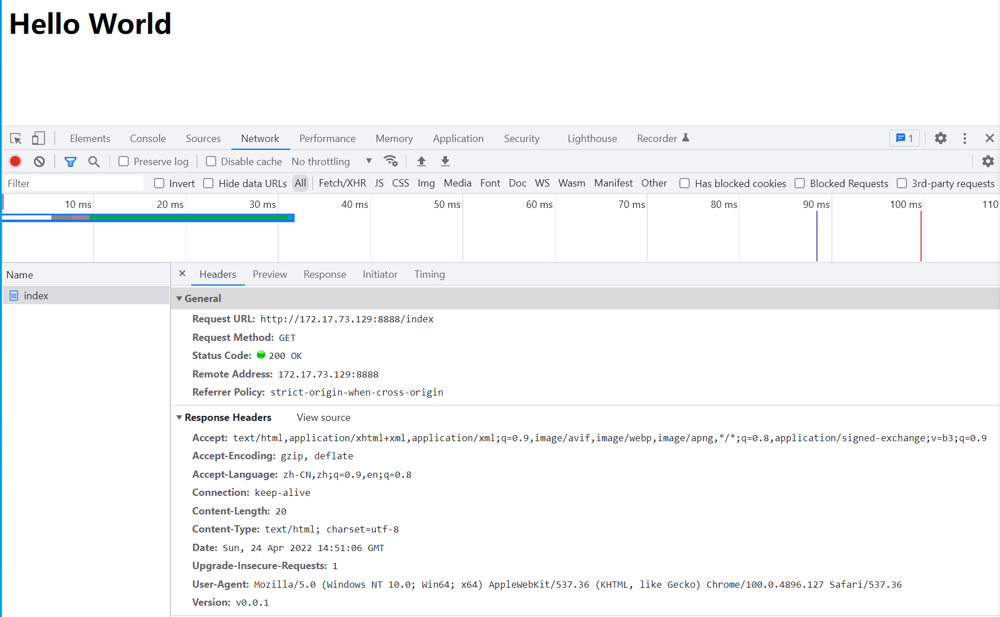

<!--
 * @Author: Galen Tong
 * @Date: 2022-04-24 22:41:00
 * @LastEditTime: 2022-04-24 22:41:01
 * @Description: 
-->

# 测试

## postman

1. healthz

2. index

3. server

## Chrome

1. healthz

2. index

3. server

